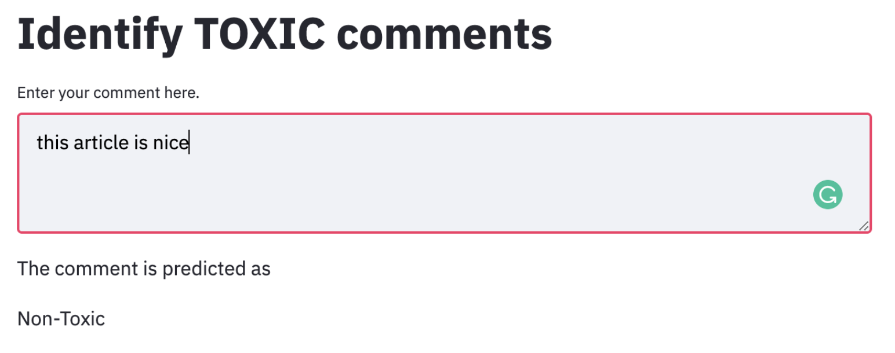
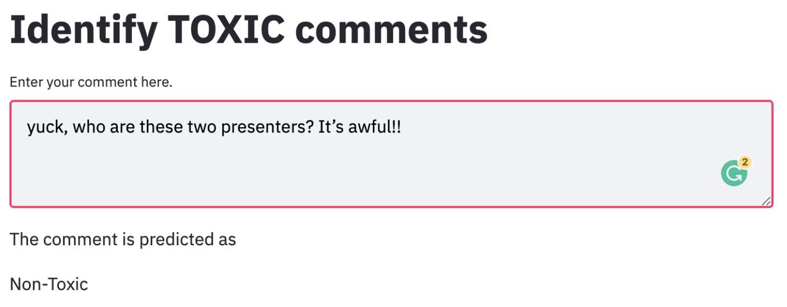
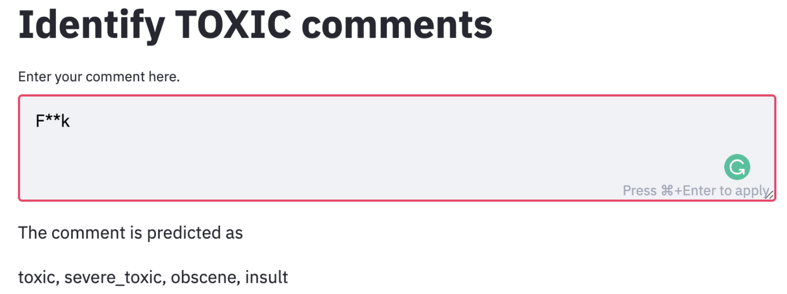

# ToxCom

This is a project for the Erdos pilot-NLP bootcamp that occured over the course of March-April 2021.

You can see our final presentation [here](https://docs.google.com/presentation/d/1RHecxApLVN0tBIS-SkA7Jv0PvJc4KHUXPktRgEiIAtE/edit?usp=sharing)

### Team Members
[Ghanashyam Khanal](https://www.linkedin.com/in/ghanashyam-khanal/)
[Dyas Utomo](https://www.linkedin.com/in/dyasutomo/)

# Project Motivation and Introduction
 
Abuse and harassment online means many people stop expressing themselves and give up on seeking different opinions. Platforms struggle to effectively facilitate conversations, leading many communities to limit or completely shut down user comments.

Our goal is to predict negative comments and label those comments into 6 categories: `toxic`, `severe toxic`, `obscene`, `threat`, `insult`, and `identity hate`. So, this is a multi-label classification problem.

We obtained 159,511 comments from Wikipedia’s talk page edits[1] with length 1 to 1250 tokens per comment and 167,897 unique tokens (outside stopwords, etc.). Data downloaded from https://www.kaggle.com/c/jigsaw-toxic-comment-classification-challenge

# Exploratory data analysis [EDA]
- Analyzed the Wordcloud for only Toxic comments vs all comments
- Bar chart of most used  words for the toxic comments
- Calculated the weighted average of number of words using apostrophe per comment to differentiate between the toxic vs non-toxic comments.

# Dealing with Data Imbalance
- The data set was an extreme case of class imbalance: ~90% data was non-toxic. 
- We focused on the minory class when modeling (via loss\_weight and scoring params)
- Analyze Precision and Recall as opposed to acccuracy due to the imbalanced data.

# Feature Processing
- Processed the text data by removing \n, apostrophe, stopwords and stemming.
- Performed Tokenization of clean data to prepare text-to-matrix, TF-IDF and Word2Vec matrices.

# Modeling
- We used multiclass classifier with different models.
- Performed the binary (toxic vs non-toxic) as well as multiclass models.
- Used model: Logistic Regression, Decision Tree, Neural Network (with Dense layer)
- Updated the model with complex parameter tuning.

# Result
- So far complex Logistic Regression performed best for the binary case.
- Best multiclass recall score was 63%. and best precision score was 75%.

## Deployment to the web
- We created an interactive web application using streamlit and hosted on heroku.
- The web app can be found http://toxcom.herokuapp.com/.

An example of non-toxic comment on the webapp.

An example of intermediate comment on the webapp.

An example of Toxic comment on the webapp.

